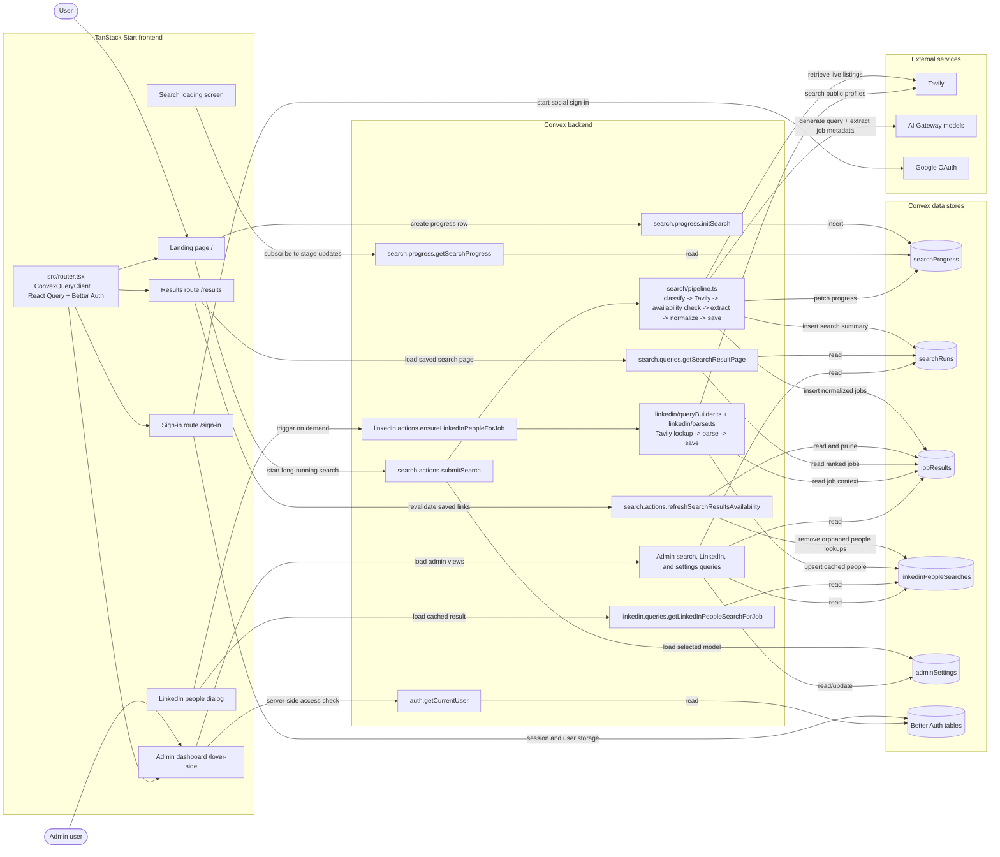
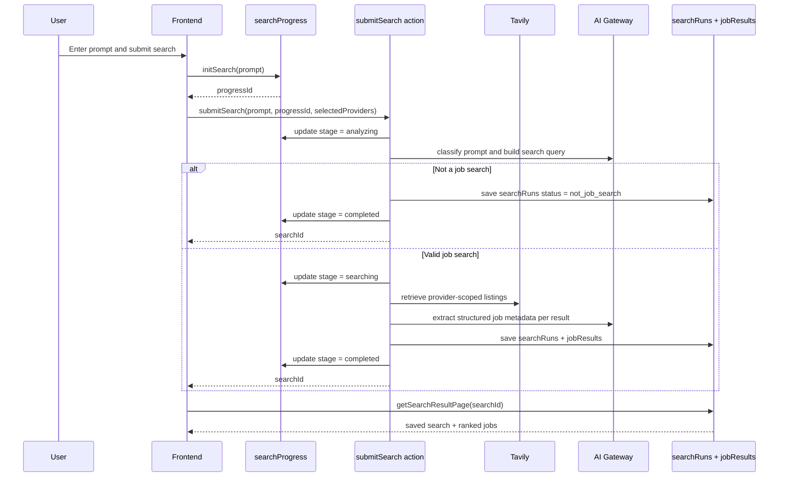

# System design diagram

This page shows how data moves through Amaris across the browser UI, Convex backend, persistent data stores, and external services.

For the narrative explanations, see [../README.md](../README.md), [./backend.md](./backend.md), and [./frontend.md](./frontend.md).

## System overview

## Main search request flow

## How to read the diagram

- **Frontend** initiates and renders flows, but long-running work is pushed into **Convex actions**.
- **Convex tables** are the source of truth for saved searches, job results, progress state, LinkedIn lookups, admin settings, and auth records.
- **Tavily** provides live retrieval, while **AI Gateway models** handle prompt classification and per-job extraction.
- **Google OAuth** is only part of the authentication path; it is not involved in the search pipeline itself.

## Key data paths

1. **Search creation** writes `searchProgress`, then `searchRuns` and `jobResults`.
2. **Results rendering** reads `searchRuns` and `jobResults`, and may prune stale jobs through the availability refresh action.
3. **LinkedIn enrichment** reads a saved job from `jobResults`, calls Tavily, and upserts `linkedinPeopleSearches`.
4. **Admin access** first checks auth state, then reads search, LinkedIn, and settings data from Convex.
